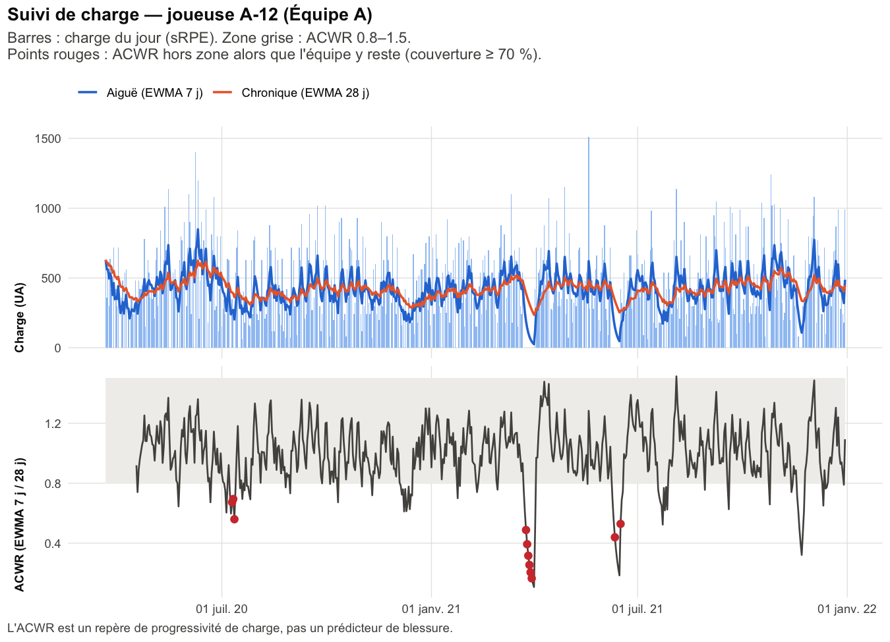
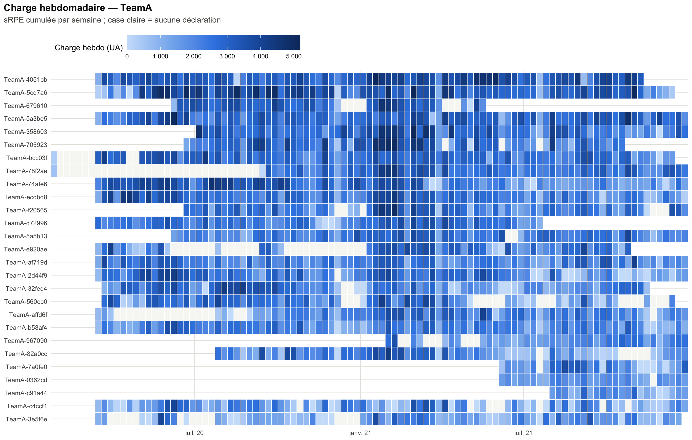
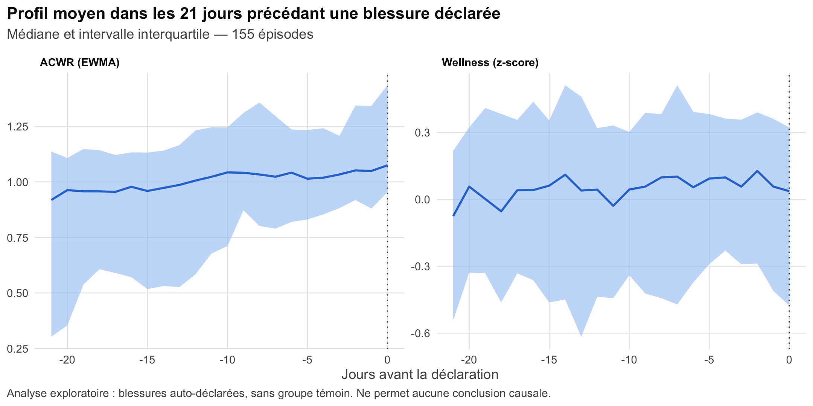
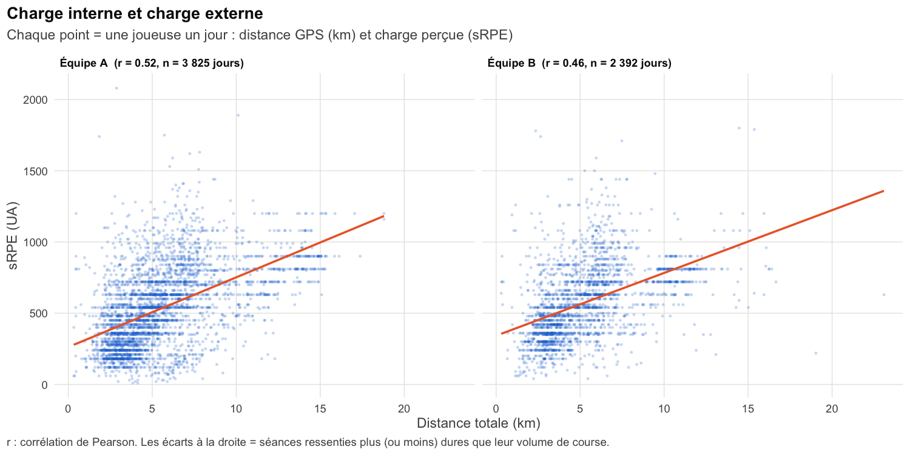

# Monitoring de la charge en football féminin d'élite

Pipeline R de **suivi de la charge interne et de l'état de forme** de joueuses, construit
sur le jeu de données ouvert [SoccerMon](https://www.nature.com/articles/s41597-024-03386-x)
(deux équipes féminines de première division norvégienne, saisons 2020–2021).

L'objectif est de reproduire le travail quotidien d'un sport scientist :
**vérifier la donnée → calculer les indicateurs → les rendre lisibles pour le staff →
poser une question de recherche appliquée.**

**[Ouvrir le tableau de bord interactif](https://julie-landrevie.github.io/womens-football-load-monitoring/)** : vue équipe, suivi individuel, qualité des données et piste de recherche, avec filtres par équipe et par période.



## Résultats sur SoccerMon (50 joueuses, 2 équipes, 2020–2021)

**1. Une limite du jeu de données repérée avant toute interprétation.**
Dans SoccerMon, un jour sans déclaration de charge vaut 0 : la charge n'est jamais
« manquante », et un repos est indiscernable d'un questionnaire non rempli. Le
pipeline restreint donc chaque joueuse à sa période active et ne déclenche une
alerte que si au moins 70 % des 28 derniers jours sont documentés (charge > 0 ou
wellness rempli). Sur la période active, la part médiane de jours avec une charge
> 0 est de 42 %, et la complétude médiane du wellness de 48 %.

**2. Des indicateurs validés.**
L'ACWR recalculé reproduit celui fourni dans SoccerMon (corrélation 1,00 ; 98 % des
21 490 jours-joueuses à moins de 0,1 d'écart). La méthode d'origine (moyennes
glissantes 7 j / 28 j, jours sans déclaration à 0) est ainsi confirmée.

**3. Des alertes qu'un staff peut réellement traiter.**
Appliqués tels quels, les seuils classiques déclenchaient une alerte sur près d'un
jour sur cinq, soit une centaine de jours par joueuse sur deux saisons : à ce
niveau, un staff ne lit plus les alertes (« fatigue d'alerte »). Trois règles,
ajoutées l'une après l'autre, les ramènent à des signaux individuels :

1. **Contexte équipe.** Lors d'une coupure ou d'une reprise planifiée, toute
   l'équipe sort de la zone d'ACWR en même temps. Une joueuse n'est signalée que si
   elle sort de la zone alors que la médiane de son équipe y reste, **avec un écart
   d'au moins 0,2** à cette médiane. Cette seule règle fait passer la part de jours
   en « sous-charge » de 19 % à 13 %.
2. **Persistance.** Une alerte de charge (ACWR, monotonie) n'apparaît qu'au
   **3ᵉ jour consécutif** hors zone : les oscillations d'un jour sont ignorées.
3. **Épisodes.** Des jours d'alerte consécutifs forment **un seul épisode**. Le
   tableau de bord affiche le nombre d'épisodes par joueuse, et le nombre de jours
   concernés au survol.

Sur les données SoccerMon, la part de jours en « sous-charge » passe de 13 % à
**3 % (équipe A) et 2 % (équipe B)**, la monotonie de 7 % à 3 % et de 3 % à 2 %,
et les hausses rapides deviennent rares (< 1 %). Il reste en médiane **13 à 16
épisodes d'alerte par joueuse et par an**, soit environ un toutes les trois à
quatre semaines : un volume qu'un staff peut examiner un par un. Les paramètres
sont réglables dans `R/00_config.R` (`team_margin`, `alert_persistence`).



**4. Piste de recherche : que se passe-t-il avant une blessure déclarée ?**
Sur 155 épisodes, l'ACWR médian augmente légèrement dans les 21 jours précédant
la déclaration (≈ 0,95 → 1,07) tout en restant dans la zone de référence, et le
wellness composite ne montre pas de baisse. **Dans ces données, le questionnaire
wellness ne semble pas anticiper les plaintes déclarées.** Résultat descriptif,
sans groupe témoin, sur des blessures auto-déclarées : il ne permet aucune
conclusion causale (voir *Limites*).



**5. Charge externe : ce que la joueuse a fait, et comment elle l'a vécu.**
Les 10 075 fichiers GPS (10 Hz, ~99 Go) ont été agrégés en 9 908 jours-joueuses
(86 séances trop courtes écartées, aucun fichier illisible). Valeurs médianes par
jour : ~4,8 km, ~270 m au-dessus de 16 km/h, ~60 m de sprint au-dessus de 20 km/h,
vitesse maximale ~23,5 km/h. La charge perçue (sRPE) et la distance sont
**modérément corrélées (r = 0,52 et 0,46 selon l'équipe)** : à distance égale, une
séance peut être vécue très différemment, ce qui justifie de suivre les deux. Le nuage
de points fait aussi apparaître des bandes horizontales vers 10–15 km et 700–900 UA,
qui correspondent vraisemblablement aux matchs (≈ 90 min × RPE 8–10).



## Ce que fait le pipeline

| Étape | Contenu | Fichier |
|---|---|---|
| Chargement | lecture des CSV SoccerMon (une colonne par joueuse), passage au format long, détection automatique des équipes | `R/01_load.R` |
| Contrôle qualité | complétude par joueuse et variable, valeurs hors bornes ou non numériques, doublons, cohérence entre l'ACWR fourni et l'ACWR recalculé | `R/02_quality.R` |
| Indicateurs | sRPE, charge aiguë/chronique (glissante et EWMA), ACWR, monotonie, strain, wellness en z-score individuel, points d'attention | `R/03_load_metrics.R` |
| Visualisation | vue qualité, vue équipe (charge hebdomadaire), vue joueuse (charge + ACWR, wellness), profil pré-blessure | `R/04_figures.R` |
| Rapport | rapport HTML autonome à destination du staff | `report/rapport_charge.Rmd` |
| Tableau de bord | export des données (`docs/data.js`) pour la page web interactive `docs/index.html`, publiée avec GitHub Pages | `R/05_dashboard.R` |
| Charge externe (GPS) | lecture des ~10 000 fichiers GPS (un par joueuse et par jour), distance totale, course > 16 km/h, sprint > 20 km/h, vitesse max, accélérations et décélérations > 2 m/s² | `R/06_gps.R`, `run_gps.R` |

Tous les seuils (fenêtres, zone d'ACWR, monotonie, seuil wellness, couverture
minimale) sont réglables dans `R/00_config.R`.

## Choix méthodologiques

- **Jours sans déclaration** : valent 0 dans SoccerMon. Analyse limitée à la
  période active de chaque joueuse ; un jour est « documenté » s'il a une charge > 0
  ou un wellness rempli ; **aucune alerte sous 70 % de jours documentés** sur 28 j.
- **Contexte équipe** : une alerte d'ACWR n'est émise que si la joueuse sort de la
  zone alors que la médiane de son équipe y reste, avec un écart d'au moins 0,2
  (pas d'alerte pendant une coupure ou une reprise collective).
- **Persistance et épisodes** : alerte de charge au 3ᵉ jour consécutif hors zone,
  et jours d'alerte consécutifs regroupés en un épisode, pour limiter la fatigue
  d'alerte. Le wellness reste un signal du jour (pas de persistance exigée).
- **Valeurs suspectes** : mises à NA pour le calcul, jamais corrigées en silence, et
  listées dans `outputs/tables/qc_valeurs_suspectes.csv`.
- **ACWR en EWMA** (Williams et al., 2017) plutôt qu'en moyennes glissantes seules,
  car il réagit moins aux pics isolés. Les deux versions sont calculées.
- **Wellness individualisé** : chaque item est comparé aux 28 jours *précédents* de la
  joueuse (sans le jour courant). Une joueuse qui note toujours 3/5 n'est pas
  comparée à une joueuse qui note toujours 5/5.
- **GPS : une ligne par instant.** Dans les fichiers SoccerMon, chaque instant GPS
  (10 Hz) est répété ~10 fois, car l'accéléromètre enregistre à 100 Hz sur des lignes
  séparées. Une seule ligne est gardée par instant, sinon les distances seraient
  multipliées par 10. La distance est intégrée avec le vrai pas de temps entre deux
  mesures ; les trous de signal de plus d'une seconde ne sont pas comblés et leur
  part est mesurée. Vitesses > 36 km/h écartées, vitesse max lissée sur 0,5 s.
- **Points d'attention, pas prédictions** : l'ACWR est débattu dans la littérature
  (Impellizzeri et al., 2020). Il sert ici de repère de progressivité de la charge.

## Lancer le projet

### 1. Prérequis
R ≥ 4.2 et les packages :
```r
install.packages(c("dplyr", "tidyr", "readr", "purrr", "stringr",
                   "ggplot2", "scales", "rmarkdown", "knitr", "jsonlite",
                   "arrow"))   # arrow : lecture des fichiers GPS (parquet)
```

### 2. Données
Télécharger **uniquement la partie subjective** de SoccerMon (environ 10 Mo ; la partie
GPS fait environ 92 Go) depuis Zenodo, DOI
[10.5281/zenodo.10033832](https://doi.org/10.5281/zenodo.10033832), puis décompresser
l'archive dans `data/raw/`. Le chargeur cherche les fichiers (`daily_load.csv`,
`fatigue.csv`, …) dans tous les sous-dossiers.

**GPS (facultatif).** Télécharger les 4 archives `objective-*.zip` (~99 Go), les
décompresser dans un dossier **en dehors du dépôt** (par ex. `~/Desktop/SoccerMon_GPS`),
puis lancer une seule fois :
```bash
Rscript run_gps.R ~/Desktop/SoccerMon_GPS
```
Le script lit les fichiers en parallèle (10 à 30 min selon la machine), peut être
interrompu et relancé sans tout refaire, et écrit une petite table
`data/processed/gps_daily.csv` (une ligne par joueuse et par jour), versionnée dans le
dépôt : le reste du pipeline n'a plus besoin des 99 Go.

### 3. Exécution
```bash
Rscript run_pipeline.R
# ou avec un autre dossier de données :
SOCCERMON_DIR=/chemin/vers/soccermon Rscript run_pipeline.R
```
Sorties : `outputs/rapport_charge.html`, `outputs/figures/`, `outputs/tables/`, et le
tableau de bord dans `docs/` (ouvrir `docs/index.html` dans un navigateur).

Les joueuses apparaissent sous des noms courts (A-01, B-01…) attribués par ordre
d'arrivée dans les données ; la correspondance avec les identifiants SoccerMon est
dans `outputs/tables/correspondance_joueuses.csv`.

### Tester sans les données
```bash
Rscript tests/make_test_data.R            # jeu SYNTHÉTIQUE au format SoccerMon
Rscript tests/make_test_gps.R             # GPS synthétiques (≈ 1,5 Go de CSV)
Rscript run_gps.R data/test_gps
SOCCERMON_DIR=data/test Rscript run_pipeline.R
```
Les résultats obtenus sur ce jeu de test n'ont aucune valeur sportive. Il sert
uniquement à vérifier que le code tourne.

## Limites et suites

- Blessures **auto-déclarées** (douleur mineure ou majeure), sans diagnostic médical.
- Analyse pré-blessure **descriptive**. Étape suivante : comparer avec des fenêtres
  sans blessure, avec un modèle mixte (effet aléatoire joueuse).
- GPS : la fréquence cardiaque enregistrée n'est pas exploitable (ceinture absente
  sur la plupart des séances) ; pas de distinction entraînement / match dans les
  fichiers.
- Étape suivante : ACWR calculé sur la charge externe (distance, haute intensité)
  et comparaison avec l'ACWR de charge interne.

## Références

- Midoglu C. et al. (2024). *A large-scale multivariate soccer athlete health, performance, and position monitoring dataset.* Scientific Data, 11, 553.
- Foster C. (1998). Monitoring training in athletes with reference to overtraining syndrome. *MSSE*.
- Foster C. et al. (2001). A new approach to monitoring exercise training. *JSCR*.
- Williams S. et al. (2017). Better way to determine the acute:chronic workload ratio? *BJSM*.
- Gabbett T. (2016). The training–injury prevention paradox. *BJSM*.
- Impellizzeri F. et al. (2020). Acute:chronic workload ratio: conceptual issues and fundamental pitfalls. *IJSPP*.

---
Julie Landrevie · [Portfolio](https://bit.ly/julie-landrevie-notion) · [LinkedIn](https://www.linkedin.com/in/julie-landrevie/)
